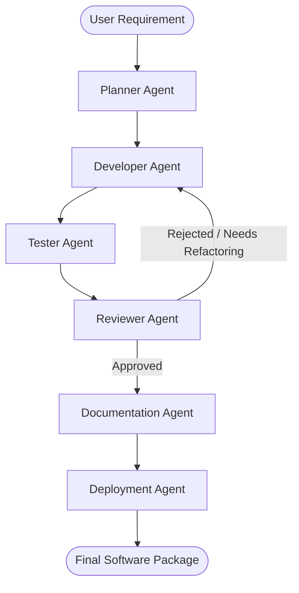

# Multi-Agent AI Software Engineering Team: Architecture

This document describes the design and orchestration pattern implemented in this platform.

## Orchestration Flow

The system simulates a complete Software Development Lifecycle (SDLC) by routing a user's request through specialized agents:



## Core Abstractions

### 1. State Object
All agents are stateless functions that operate on a shared state object representing the project workspace. 

```python
{
    "user_request": str,
    "development_plan": str,
    "tasks": list,
    "architecture": str,
    "source_code": dict,
    "test_files": dict,
    "test_results": dict,
    "review_summary": dict,
    "documentation": str,
    "deployment_files": dict
}
```

### 2. BaseAgent
Each specialized agent inherits from the `BaseAgent` class:

```python
class BaseAgent:
    def __init__(self, name: str, role: str):
        self.name = name
        self.role = role

    def execute(self, state: dict) -> dict:
        # Agent logic goes here
        pass
```

## Agent Responsibilities

| Agent | Responsibility | Outputs |
|---|---|---|
| **Planner** | Requirement analysis, architecture planning, sprint backlog task generation. | `development_plan`, `tasks`, `architecture` |
| **Developer** | Generating source code, API routes, database connections. | `source_code` |
| **Tester** | Unit/integration test creation, testing edge cases. | `test_files`, `test_results` |
| **Reviewer** | Static code analysis, security checks, style linting. | `review_summary` |
| **Documentation** | Creating API docs, user guides, and project README. | `documentation` |
| **Deployment** | Creating Dockerfiles, Kubernetes manifests, and CI/CD pipelines. | `deployment_files` |
